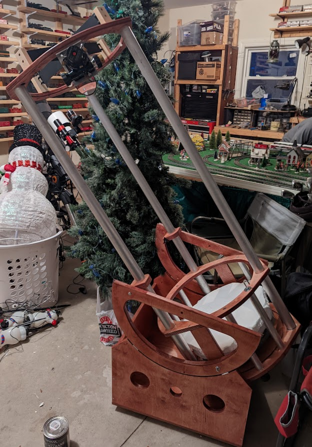
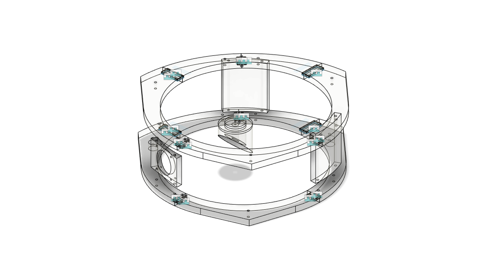

# 3d-printed-dobsonian
 I am starting this project because I needed to make some changes to a dobsonian telescope kit that I purchased and assembled at the beginning of 2022. I purchased the kit from Dennis Steele at [DobStuff](http://dobstuff.com/) and I believe he has since retired.

 I needed more adjustabiliy of the alignment of my focuser and the diagonal mirror, so the inital focus of this project is to build a cage for the secondary mirror and focuser. 

